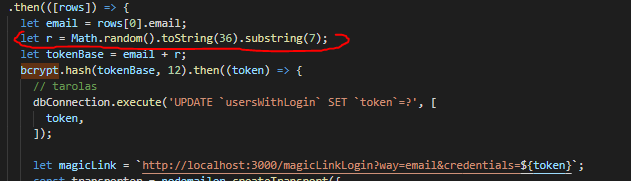
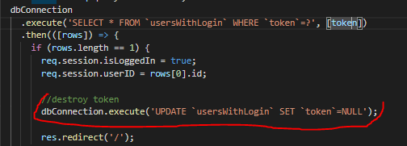

A MagicURL problemak kikuszobolesere a kovetkezo javitasokat eszkozoltem:

- 1. A belepesi token generalasahoz nem szemelyes adatot, hanem egy 0-tol 7 hosszusagig kigeneralt random stringet hasznaltam, majd ezt egy egyiranyu hashalgoritmussal dolgoztam fel.
     
- 2. A tokent taroltam a felhasznalo soraba azert, hogy ellenorizni tudjam.
- 3. Talan ez a legfontosabb ovintezkedes: a token egyszeri elleorzese utan azt toroltem az adatbazisbol, hogy a link ne legyen tobbe ervenyes. A random string es a hasheles megengedi szamunkra,
     hogy bar nem teljesen, de erosen magabiztosan kimondhassuk, hogy ha senki sem allitja vissza az adatbazisunk allapotat, akkor azzal a linkkel tobbe nem lehet bejelentkezni.
     

A javitott kod elerheto [ezen](https://github.com/Elod23/MagicURLDemoApp/tree/javitott) a linken.
