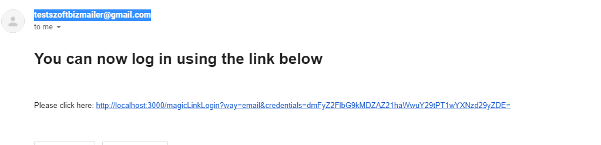

A MagicURL gyengesegeinek bemutatasai vegett a kovetkezo resek lettek beepitve a kodba:

Tamadas leirva, lepesek szerint:

- A felhasznalo regisztral
- Belepesnel a Get magic Link gombra kattint
- Lekeri a regisztralt emailcimre a Magic Linket

A megkapott emailben egy hasonlo linket talalunk.

Biztonsagi resek:

- A link esetleges ellopasa utan azt a lejarataig akarki, akarhol, akarmeddig felahsznalhatja egy user session kialakitasaert,
  azt pedig addig tarthatja nyitva, ameddig a rendszer engedi.
- A Magic Link vilagosan leirja hogy milyen autentikacios fazisokat implementaltunk. Ez elosegiti a DDos vagy bruteforce tamadasokat.
- A Link tartalmaz egy credentials URL parametert, amiben ha az = karaktereket megfigyeljuk konnyen rajovunk hogy base64 kodolt.
  Abban az esetben ha nem kivanjuk tarolni a teljes tokent, ez kikerulhetetlen, hiszen vissza is kell tudjuk fejteni az adatokat.
- Ezt egy akarmilyen base64 dekoderbe bevezethetjuk, igy megkapjuk a belepeshez szukseges jelszo hashelt valtozatat.
  Bar ezt komputacionalisan koltseges feltorni, megis folosleges kockazatot vallalunk.

Easter egg: az SQL paranccsal bevitt felhasznalo jelszavat is megtudhatjuk akkor, ha valahogy hozzaferunk az emailfiokjahoz.

- Teszt emailfiok jelszo: Test123!
- Teszt emailfiok: testsoftbizmailer@gmail.com

Ez is azt bizonyitja, hogy abban az esetben, ha Magic Linkek hasznalata mellett dontunk roppant figyelmesek kell legyunk az adatbazisunk tartalmara.
A nem hagyomanyos regisztracio altal letrehozott felhasznalok(pl. rendszerszintu felhasznalok) adatai konnyen idegen kezbe kerulhetnek altala.

- A linkre valo klikkeles utan a URL bekerul a bongeszonk URL szovegmezojebe, innentol pedig akarki, aki rogziti bongeszonk tevekenyseget elerheti a benne rejlo szemelyes adatot.
  

A folyamat veghezvitelehez es egy sikeres bejelentkezeshez:

- Kerjunk magic linkes belepest a testsoftbizmailer@gmail.com email cimre.
- Jelentkezzunk be a gmail-be.
- Klikkeljunk a linkre.
- Kivancsisag eseten a `credentials=XXX` = utani reszet vigyuk be egy base64 dekoderbe.
- A jelszo visszafejtese utan lepjunk ki es jelentkezzunk be jelszoval.

!!Fontos figyelni arra, hogy jeletkezzunk ki, mielott mas belepesi modszert hasznalunk. Pl. ne legyunk bejelentkezve egy felhasznaloval egy ablakban magic link segitsegevel, a masik ablakba pedig probaljunk belepni jelszoval.
